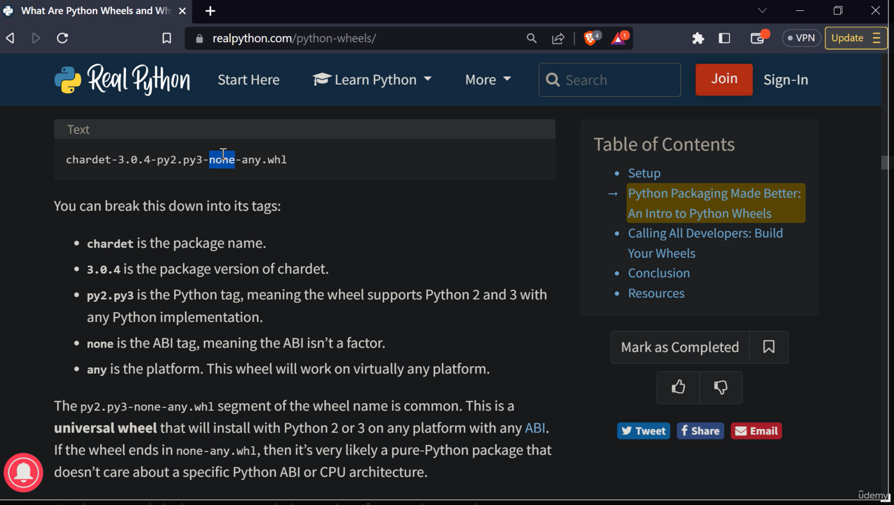

# Python Packaging Index

The pypi website contains the **zip file** contains python code as well as crucial metadata about the code and allows us to run it ourself. So a **package** is a distributable set of python code together with the metadata about how to run that code. 

## Why do we need to package the code? 

The first advantage is that **distributing your code**, there are lot of ways you can distribute your code like `cli`, and `executable`. Packaging is one of the way you can **distribute** our code. Eventhough you're a team of one, packaging a code can give lot of benefits. Will discuss this part later.

The second advantage is that **non-painful import statements**. If you're working with multiple python files, you will sure have a problem with import the module for 1 dir away. 

The third advantage is that **reproducibility**, it means the ability to run your code or rerun your code and always get consistent results. 

And, having this skill is going to seriously improve quality of life while you're writing code. 

## Concepts in packaging

### 1. PythonPath

There are two types of import in python
   1. Relative Import 
   2. absolute Import 
   
**Relative**: `from ..myotherfile import CONSTANT`

**Absolute**: `from packaging.myotherfile import CONSTANT`


You can easily import a file under your file directory however If you want to import a file above your file directory using **relative** or **absolute** import you wil get a error like **module** not found. 

To solve this issue we can use **PYTHONPATH** variable to solve this problem. **PYTHONPATH** variable contains a list of folders where python looks for modules when you do these import statements.  


**First method to solve the issue**: 

If you want to import a module which contains above your directory you can **append** the parent directory to the python path and then you can import a module without any error. 

`PYTHONPATH=$PYTHONPATH:/workspaces/Learning_py_to_prod-pypi python packaging/sub_package/myfile.py`

But this will only work if you're calling the file with python path, if you're calling normal way `python packaging/sub_package/myfile.py` it won't work. You will get a error like **package** (module) not found. 

**Second method to solve this issue**: 

In last approach we have to call the file with pythonpath, let's solve this issue by adding the path to the sys. 

```python
import sys 
sys.path.insert(0, "/workspaces/Learning_py_to_prod-pypi")
from packaging.myotherfile import CONSTANT
```

It will work for sure, because we are adding to the path everytime we are calling the function. But this is the **worst way of doing this**. 


**Third method to solve this issue (proper way):**

Third and best way to do this **packaging the code**. There are lot of ways you can package the code, but we're gonna see the **legacy way** of packaging the code using **setup** module availale in python.


### 2. Terms

**Module**: 

> Module is a **single piece** or **portion** of an **import path** in python. People also say that module is a **file** ends in **.py** however this **module** can be also a **folder** contains `__init__.py` file.

**Package**:  

> A python **module** which contains **submodules** or **subpackages**. Technically, a package is a python module with a `__init__.py` and some other **.py** files.

**Distribution package**: 

> Distribution package is basically a **zip file** containing all of the **python files**. This is what we are going to build.


### 3. Creating Distribution Package

Well, back in the 1980s, the python standard library had a builtin library called **distutils**. It had lot of utilities for creating **distribution package in python** but it had lot of error and hard to use. So the third party called **setup utils** basically a wrapper of the **distutils**. 

This is the legacy way of creating a **python distribution package**.  Check the **setup.py** file.

After packaging the code, you can remove the **second method to solve this problem** and run without doing anythng. :)


#### 3.1 Reporducability 

**Reproducibility** is a characteristic of the code you write that makes it so across time or across different machiens or across different environments where you r code might be running. You can always re-run the code to get the similar results. 

However if we are not mentioning the pacakging details with version it's impossible to reproduce the code. So we should metion the packages used in the package. To implement this, you can add the **install_requries** in the setup.py file. 

#### 3.2 Distribution formats 

##### **3.2.2 Sdist** 

So far we discussed about **sdist** (source distribution) distriubtion package format, we've been doing that by `python setup.py build sdist`. Source distribution means that distribution contains a subset of our source code. Essentially we take the source code from our project and just zipped them up into the tar file. One interesting thing is it contains the copy of the source code. Moreover, there are lot of problem with this format about compiling, soruce code and more. So people proposed a new distribution format called **wheel**. This is solving all the problems in the sdist distribution format. 

**sidst shortcommings** 

1. May make assumptions about customer machine e.g. requires "gcc" to run "gcc numpy/*.c" 
2. Is slow: setup.py must be executed, compilation may be required. 
3. Is insecure: setup.py may contain arbirary code. 

##### **3.2.3 Wheel**

The soultion for all the shortcommings is a relatively new distrubiotn package formt that is not the soruce distribution, Instead it's a format called **binary distribution** format,  It has the precompiled binaries already inside.  

To simply run a **wheel** format run this command: `python setup.py bdist_wheel` Before running this we have to add a **wheel** extension to the **setup.py** file by simply installing `pip install wheel`. 

After running this, you can see the **dist** folder contains **wheel** (binary) file instead of **tar** file and also you can see the file name is really big compare to the old one. After building this, you can run `pip install /workspaces/Learning_py_to_prod-pypi/dist/packaging-0.0.0-py3-none-any.whl`

If you want to understand the file name, check this: 




The advantage of **wheel** file is **precompiled binary** file. So, ther's no reason user to run the **setup.py** file. The **downside** of this, it puts more onus on the producer of the package or the publisher of the package to actualy build mutliple version of their package because they're going to have to build one per platform and maybe even per python version. 


### 4. Build Dependencies 

We talked about **package dependencies** before, which are all the packages that we include in the install require array. A **build dependency** is something that is required to build the package in the first place. The exmaple of the dependecy is **wheel** and **sdist** distrubution formats.

